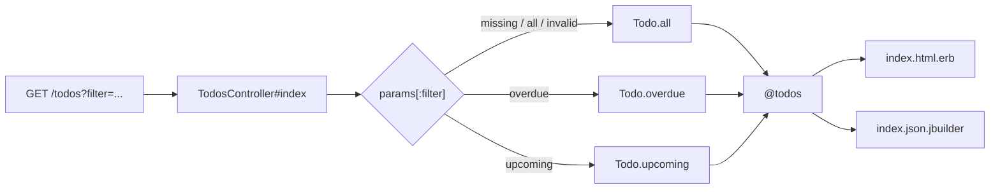

## GH hw5 branch
[homework-5-calebweldon (hw5)](https://github.com/NU-CS-Software-Studio-Spring-26/homework-5-calebweldon/tree/hw5)

## PART 1
- [.cursorignore](https://github.com/NU-CS-Software-Studio-Spring-26/homework-5-calebweldon/blob/hw5/.cursorignore)

## PART 2
- [AGENTS.md](https://github.com/NU-CS-Software-Studio-Spring-26/homework-5-calebweldon/blob/hw5/AGENTS.md)
- [.cursor/rules/rails-conventions.mdc](https://github.com/NU-CS-Software-Studio-Spring-26/homework-5-calebweldon/blob/hw5/.cursor/rules/rails-conventions.mdc)
- [.cursor/rules/security.mdc](https://github.com/NU-CS-Software-Studio-Spring-26/homework-5-calebweldon/blob/hw5/.cursor/rules/security.mdc)

## PART 3 (ASK)
- **Prompt:** Where in this codebase is "where the todos index is filtered" currently implemented? Cite the
exact files and line numbers. Do not propose changes.
- app/views/todos/index.html.erb [lines 5-7] (todos index is not filtered beyond loading every todo from the DB)
- app/controllers/todos_controller.rb [lines 6-13] (no filtering)
- app/views/todos/index.json.jbuilder [line 1] (no filtering)
- app/models/todo.rb [no lines] (no filtering)
- I confirmed that the citations are real

## PART 3 (PLAN)
- **Prompt:** I want to change where the todos index is filtered so that the index supports a filter query param with values all (default), overdue (todos with a due date in the past), and upcoming (todos due within the next 7 days). Propose a plan as a numbered list of changes, including files to edit, new tests to add, and any migration. Do not write code.

- **Plan from agent:**
---
name: Todo Index Filtering
overview: Add overdue/upcoming/all filtering to the todos index via a `filter` query param, with model scopes, controller logic, view controls, fixtures, and model/controller tests. No migration needed.
todos:
  - id: model-scopes
    content: Add overdue and upcoming scopes to app/models/todo.rb
    status: pending
  - id: controller-filter
    content: Wire params[:filter] in TodosController#index
    status: pending
  - id: view-controls
    content: Add All/Overdue/Upcoming filter links or form to index.html.erb
    status: pending
  - id: fixtures
    content: Update test/fixtures/todos.yml with distinct due_date values
    status: pending
  - id: model-tests
    content: Add scope tests in test/models/todo_test.rb
    status: pending
  - id: controller-tests
    content: Add filter param tests in test/controllers/todos_controller_test.rb
    status: pending
  - id: system-test
    content: "Optional: add system test for filter link clicks in test/system/todos_test.rb"
    status: pending
isProject: false
---

# Todo Index Filter Plan

## 1. Add model scopes in [`app/models/todo.rb`](app/models/todo.rb)

- Add two scopes that only consider todos with a non-null `due_date`:
  - `overdue`: `due_date` is before the current time
  - `upcoming`: `due_date` is between now and 7 days from now (inclusive of that window)
- Todos with no `due_date` should be excluded from both filtered scopes and only appear under `all`.
- Keep query logic in the model so it is reusable and testable.

Example scope shape:

```ruby
scope :overdue, -> { where.not(due_date: nil).where("due_date < ?", Time.current) }
scope :upcoming, -> { where.not(due_date: nil).where(due_date: Time.current..7.days.from_now) }
```

## 2. Apply the filter in [`app/controllers/todos_controller.rb`](app/controllers/todos_controller.rb)

- Replace `@todos = Todo.all` in `#index` (line 6) with logic that reads `params[:filter]`.
- Supported values:
  - missing, blank, or `"all"` → `Todo.all`
  - `"overdue"` → `Todo.overdue`
  - `"upcoming"` → `Todo.upcoming`
- Unknown values should fall back to `Todo.all`.
- Assign `@todos` once in the controller so HTML and JSON index responses stay in sync. Do not duplicate filtering in [`app/views/todos/index.html.erb`](app/views/todos/index.html.erb) or [`app/views/todos/index.json.jbuilder`](app/views/todos/index.json.jbuilder).

Suggested controller pattern:

```ruby
def index
  @todos = case params[:filter]
           when "overdue" then Todo.overdue
           when "upcoming" then Todo.upcoming
           else Todo.all
           end
end
```

## 3. Add filter controls to [`app/views/todos/index.html.erb`](app/views/todos/index.html.erb)

- Add simple links or a GET form above the todo list for `All`, `Overdue`, and `Upcoming`.
- Each control should hit `/todos?filter=...` using normal Rails URL helpers (e.g. `todos_path(filter: "overdue")`).
- No new JavaScript or Stimulus controller is required.

## 4. Update fixtures in [`test/fixtures/todos.yml`](test/fixtures/todos.yml)

- Give fixtures distinct `due_date` values so tests can distinguish:
  - one overdue todo
  - one upcoming todo (within 7 days)
  - one with no due date
  - optionally one due more than 7 days out (should not appear in `upcoming`)
- Use distinct `description` values per fixture so controller tests can assert on response body content.

## 5. Add model tests in [`test/models/todo_test.rb`](test/models/todo_test.rb)

- Test `Todo.overdue` returns only past-dated todos with a due date.
- Test `Todo.upcoming` returns only todos due within the next 7 days.
- Test todos without a `due_date` are excluded from both scopes.

## 6. Add controller tests in [`test/controllers/todos_controller_test.rb`](test/controllers/todos_controller_test.rb)

- Keep the existing `"should get index"` test for the default unfiltered case.
- Add tests for:
  - `GET /todos?filter=overdue` returns success and only overdue fixture(s)
  - `GET /todos?filter=upcoming` returns success and only upcoming fixture(s)
  - `GET /todos?filter=all` returns all todos
  - invalid filter value falls back to all todos
- Assert on assigned records or response body content using fixture descriptions.
- Optionally add one JSON index test to confirm filtered `@todos` is serialized the same way.

## 7. Optional system test in [`test/system/todos_test.rb`](test/system/todos_test.rb)

- Only if filter links are added in step 3: visit index, click `Overdue`, and assert only the expected todo appears.
- Not required if controller/model tests are thorough, but useful for the new UI controls.

---

**Migration:** None. The `due_date` column already exists via [`db/migrate/20260519180933_add_due_date_to_todo.rb`](db/migrate/20260519180933_add_due_date_to_todo.rb).

**Files to edit:**

- [`app/models/todo.rb`](app/models/todo.rb)
- [`app/controllers/todos_controller.rb`](app/controllers/todos_controller.rb)
- [`app/views/todos/index.html.erb`](app/views/todos/index.html.erb)
- [`test/fixtures/todos.yml`](test/fixtures/todos.yml)
- [`test/models/todo_test.rb`](test/models/todo_test.rb)
- [`test/controllers/todos_controller_test.rb`](test/controllers/todos_controller_test.rb)

**Verification:** Run `bin/rails test` after implementation to confirm all new and existing tests pass.


 
- **My edits:**
  - Dropped the system test (step 7). model + controller tests cover enough for now.
  - Choose plain filter links in the view instead of a GET form. Three links (All / Overdue / Upcoming) with `?filter=...` is all we need
  - Freeze time in tests with `travel_to` so overdue/upcoming don't break depending on when you run them.

## PART 3 (AGENT)
- **Prompt:** Implement only step 1 from my plan found under "### PART 3 (PLAN)" in submission.md

- **Commit:** [d503a6f](https://github.com/NU-CS-Software-Studio-Spring-26/homework-5-calebweldon/commit/d503a6f)

## PART 3 (PROMPT REWRITE)
- **Bad Prompt:** Users can't set a due date when creating or editing a todo

- **Good Prompt:**
    1. **Context:** The following paths are relevant:
        - `db/schema.rb`: `todos` table with a `due_date` column
        - `app/models/todo.rb`: `overdue`/`upcoming` scopes for filtering
        - `app/controllers/todos_controller.rb`: where create/update flow lives (`#create`, `#update`, `todo_params`)
        - `app/views/todos/_form.html.erb`: form partial
        - `test/controllers/todos_controller_test.rb`: controller tests

    2. **Task:** Allow `due_date` to be saved when creating or updating a todo; add it to strong params and add a due-date field to the form.

    3. **Expected vs. actual:**
        - **Expected:** `POST /todos` or `PATCH /todos/:id` with a `due_date` param saves that value on the record.
        - **Actual:**
            - `app/views/todos/_form.html.erb` has no due-date field, so the browser never sends one.
            - `todo_params` in `app/controllers/todos_controller.rb` (line 75) only permits `:description`, so any `due_date` param is silently dropped.
            - The request still succeeds, but the saved todo’s `due_date` remains `nil`.

    4. **Constraints:**
        - Please refer to `rails-conventions.mdc` and `security.mdc`
        - You may edit `app/controllers/todos_controller.rb`, `app/views/todos/_form.html.erb`, `test/controllers/todos_controller_test.rb`
        - Do not add gems, migrations, or JavaScript
        - Use `params.expect(...)` for strong params

    5. **Done when:**
        - A new test in `test/controllers/todos_controller_test.rb` creates a todo with a `due_date` and asserts the saved record’s `due_date` matches
        - A new test in `test/controllers/todos_controller_test.rb` updates an existing todo with a `due_date` and asserts the saved record’s `due_date` matches
        - `bin/rails test test/controllers/todos_controller_test.rb` passes

## PART 4 (DISCOVER)
Turbo Streams are a way to only render part of a view without having to re-render the whole page or redirect. Concretely, a Turbo Stream response is an instruction document, where each instruction is a `<turbo-stream>` element telling the browser which DOM node to change and how. Turbo (the client library) reads the stream response and applies each `<turbo-stream>` instruction to the DOM. 

One thing that AI told me is that Turbo Stream responses use the MIME type `text/vnd.turbo-stream.html`. I verified this in the Turbo Streams handbook under the section "Streaming From HTTP Responses". The section shows `Content-Type: text/vnd.turbo-stream.html; charset=utf-8` on a sample response, and says that Turbo injects that type into the `Accept` header on form submissions. This matches what the AI told me. 

Turbo Streams follow CoC principles in a Rails app. For example, say we wanted the `#create` action in `TodosController` to return a turbo stream format. Firstly, inside the `create` action's `respond_to` block, we would add `format.turbo_stream` under the existing `format.html` and `format.json`. By convention, this would wire to a matching view in `app/views/todos/create.turbo_stream.erb`. This view would contain something along the lines of:
```
<%= turbo_stream.append "todos" do %>
  <%= render @todo %>
<% end %>
```

## PART 4 (WORKFLOW)
[link to my PR](https://github.com/NU-CS-Software-Studio-Spring-26/homework-5-calebweldon/pull/1)